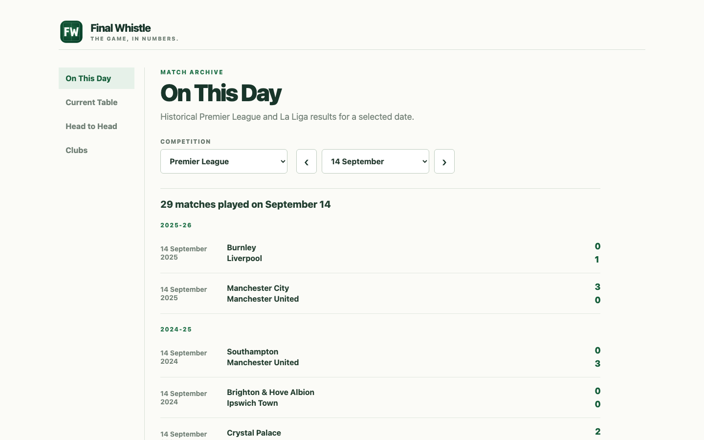
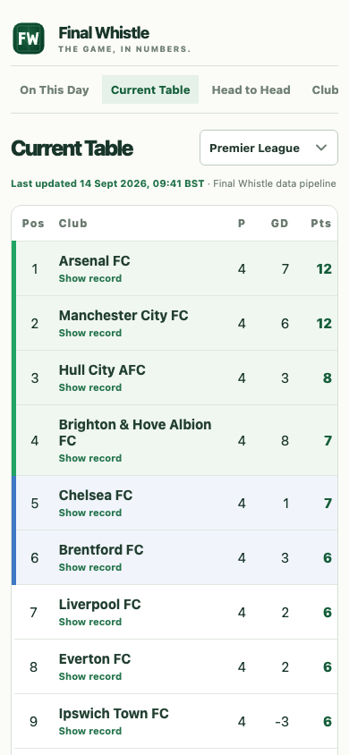
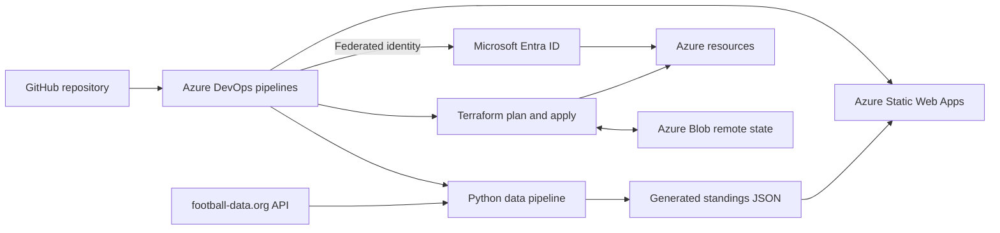

# Final Whistle

A responsive football statistics website for exploring historical match results and current league standings across the Premier League and La Liga.

[View the live website](https://lively-smoke-0de52a703.5.azurestaticapps.net/)

## Preview

### Desktop



### Mobile

<p align="center">
  
</p>

## Why I Built This Project

Football is one of my main hobbies, so I decided to build a football results and standings website while developing practical skills in Azure, Terraform, Azure DevOps, Python, and CI/CD.

I created Final Whistle with help from AI as a learning assistant. It was not treated as a copy-and-paste project. I introduced the solution incrementally, studied why each component was needed, tested every meaningful change, investigated failures, and corrected problems as they appeared.

The objective was to understand the complete delivery process well enough to explain, operate, troubleshoot, and extend it myself.

## Features

- Historical Premier League and La Liga matches by calendar date
- Current league standings
- Head-to-head club comparisons
- Individual club records
- Responsive desktop and mobile layouts
- Swipe navigation between sections on mobile devices
- Standings refreshed every four hours
- Visible timestamp showing when the data was last updated
- Automated verification that the live site contains data from the latest deployment

## Architecture



The project separates application delivery from infrastructure delivery:

- The Python pipeline retrieves and transforms the current standings.
- The site pipeline validates and deploys the website and generated data.
- The Terraform pipeline validates, scans, plans, and applies infrastructure changes.
- A separate scheduled pipeline checks for infrastructure drift.
- Azure DevOps authenticates to Azure through workload identity federation.

## Technology Stack

| Area | Technology |
| --- | --- |
| Front end | HTML, CSS, JavaScript |
| Data pipeline | Python 3.12, Requests |
| Testing | pytest |
| Infrastructure as code | Terraform |
| Terraform provider | AzureRM |
| Cloud platform | Microsoft Azure |
| Hosting | Azure Static Web Apps |
| Terraform state | Azure Blob Storage |
| Governance | Azure Policy and resource tagging |
| Cost management | Azure resource-group budget |
| CI/CD | Azure DevOps YAML pipelines |
| Authentication | Workload identity federation |
| Security scanning | Checkov |
| Source control | Git and GitHub |
| Current standings | football-data.org |
| Historical match data | OpenFootball |

## CI/CD Pipelines

The repository contains four Azure DevOps pipelines with separate responsibilities.

| Pipeline | Purpose |
| --- | --- |
| `python-ci.yml` | Installs the Python project, runs pytest, and publishes test results |
| `site-deploy.yml` | Refreshes standings, validates website files, deploys the site, and verifies the live deployment |
| `terraform-ci.yml` | Formats, validates, security-scans, plans, and applies Terraform changes |
| `terraform-drift.yml` | Runs weekly and fails when Azure differs from the Terraform configuration |

### Python CI

The Python pipeline runs for relevant pull requests and changes merged into `main`.

It:

1. Selects Python 3.12.
2. Installs the project and test dependencies.
3. Runs the pytest test suite.
4. publishes the results in Azure DevOps.
5. Fails if the expected test-results file is missing.

Checking for the results file prevents a false successful pipeline where no tests actually ran.

### Website Deployment

The website pipeline runs after relevant changes are merged and on a four-hour schedule.

It:

1. Installs the Python application.
2. Retrieves Premier League and La Liga standings.
3. Generates static JSON files and an update timestamp.
4. Confirms that all expected website and data files exist.
5. Validates the generated JSON.
6. Retrieves the Static Web App deployment token securely.
7. Deploys the website.
8. Performs a live smoke test.
9. Confirms that the live update timestamp matches the current pipeline run.

The final timestamp comparison prevents an old or cached deployment from being reported as successful. The check retries briefly while Azure completes deployment propagation.

A personal Azure DevOps notification sends an email if the site-deployment pipeline fails.

### Terraform Delivery

Terraform changes use separate Plan and Apply stages.

The Plan stage:

1. Installs a pinned Terraform version.
2. verifies the Azure subscription.
3. Checks Terraform formatting.
4. Validates both Terraform configurations.
5. Runs Checkov security scanning.
6. Confirms that Checkov scanned real resources without parsing errors.
7. Verifies that the expected remote state exists.
8. Creates and publishes a saved Terraform plan.

The Apply stage:

1. Runs only for the `main` branch.
2. Requires approval through an Azure DevOps environment.
3. Downloads the saved plan.
4. Applies the exact plan that was reviewed.

Using the saved plan reduces the risk of applying actions that differ from the reviewed execution plan.

### Drift Detection

The weekly drift pipeline runs:

```bash
terraform plan -detailed-exitcode
```

Terraform uses three relevant exit codes:

| Exit code | Meaning |
| --- | --- |
| `0` | The infrastructure matches the configuration |
| `1` | Terraform encountered an error |
| `2` | Terraform found infrastructure changes |

The pipeline converts exit code `2` into a failed Azure DevOps run so that manually introduced Azure changes cannot pass silently.

## Terraform Design

The project uses two Terraform root configurations.

### Application Infrastructure

The `infra` configuration manages:

- Azure resource group
- Azure Static Web App on the Free plan
- Resource-group budget and email thresholds
- Required `workload` tag policy assignment
- Consistent workload, environment, ownership, and deployment tags

### Backend Infrastructure

The `infra/bootstrap` configuration manages the infrastructure used to store Terraform state:

- Dedicated backend resource group
- Azure Storage account
- Private blob container
- Seven-day blob and container soft deletion
- HTTPS-only access
- TLS 1.2 minimum
- Shared Key authentication disabled
- Azure AD authentication for Terraform
- `prevent_destroy` protection on critical backend resources

These backend resources existed before the bootstrap configuration and were brought under Terraform management using `import` blocks.

The application and backend configurations use separate state files. This avoids the circular problem of storing the backend’s state inside a backend that does not exist yet.

## Security and Governance

The project includes the following controls:

- Workload identity federation instead of a stored Azure client secret
- Least-privilege Azure role assignments scoped to the required resources
- Private Terraform state container
- Shared Key authentication disabled on the state storage account
- HTTPS-only storage access with TLS 1.2
- Terraform state soft-delete protection
- Checkov infrastructure security scanning
- Explicit validation that Checkov scanned at least one resource
- Explicit failure when Checkov reports parsing errors
- Azure Policy requiring the `workload` tag
- Pull-request checks before changes are merged
- Approval-controlled infrastructure deployment
- Scheduled Terraform drift detection
- Pipeline failure email notification

Checkov exceptions are documented next to the affected resources with their technical and cost justification rather than being silently ignored.

## Cost Controls

The project is designed to keep ongoing costs low:

- Azure Static Web Apps uses the Free plan.
- Terraform state uses Standard LRS storage.
- The development environment does not use a private endpoint or private build agent.
- The standings schedule balances data freshness with API usage.
- A resource-group budget sends a forecast alert at 80% and an actual-cost alert at 100%.
- Common tags support workload identification and cost tracking.

Some stronger enterprise controls would increase cost or operational complexity. Where those controls were not appropriate for this learning environment, the decision is documented in the Terraform configuration.

## Repository Structure

```text
final-whistle-v2/
├── infra/
│   ├── bootstrap/           # Terraform backend infrastructure
│   ├── backend.tf           # Application remote-state configuration
│   ├── main.tf              # Main Azure resources
│   ├── policy.tf            # Azure Policy assignment
│   ├── providers.tf         # Terraform and provider requirements
│   ├── variables.tf         # Input variables
│   └── outputs.tf           # Terraform outputs
├── pipelines/
│   ├── python-ci.yml        # Python validation pipeline
│   ├── site-deploy.yml      # Data refresh and website deployment
│   ├── terraform-ci.yml     # Terraform plan and apply
│   └── terraform-drift.yml  # Scheduled drift detection
├── scripts/
│   └── build_current_standings.py
├── site/
│   ├── data/                # Historical and generated standings data
│   ├── app.js               # Website behaviour
│   ├── index.html           # Website structure
│   └── styles.css           # Responsive presentation
├── src/
│   └── finalwhistle/        # Python application package
├── tests/                   # Python unit tests
└── pyproject.toml           # Python project configuration
```

## Running the Project Locally

### Requirements

- Python 3.12 or later
- Git
- A football-data.org API token for refreshing current standings
- Terraform and Azure CLI for infrastructure work

### Install the Python Project

```bash
python3.12 -m venv .venv
source .venv/bin/activate
python -m pip install --editable ".[dev]"
```

### Run the Tests

```bash
python -m pytest
```

### Refresh Current Standings

Set the API token for the current terminal session:

```bash
export FOOTBALL_DATA_API_TOKEN="your-token"
```

Generate the standings files:

```bash
python scripts/build_current_standings.py
```

The token must never be committed to source control. Azure DevOps stores it as a secret pipeline variable.

### View the Website

```bash
python -m http.server 8000 --directory site
```

Then visit:

```text
http://localhost:8000
```

## Working with Terraform

Authenticate to the correct Azure subscription before running Terraform:

```bash
az login
az account show
```

Format and validate the application configuration:

```bash
terraform -chdir=infra fmt -check -recursive
terraform -chdir=infra init
terraform -chdir=infra validate
```

Preview infrastructure changes:

```bash
terraform -chdir=infra plan
```

The Azure DevOps pipeline is the normal deployment path because it provides a saved plan, approval gate, consistent identity, and an auditable execution history.

The backend configuration under `infra/bootstrap` should be handled separately and carefully because it protects the state used by the main configuration.

## Data Sources and Attribution

Historical match data is provided by the [OpenFootball](https://github.com/openfootball/football.json) project.

Current standings are retrieved from [football-data.org](https://www.football-data.org/).

Final Whistle is an independent learning and portfolio project. It is not affiliated with, endorsed by, or sponsored by any football league, competition, or club. Data remains subject to the terms of its respective providers.

## What I Learned

This project provided practical experience with:

- Designing separate CI and CD responsibilities
- Writing Azure DevOps pipelines in YAML
- Publishing and applying an exact Terraform plan artifact
- Protecting deployments with an approval gate
- Using workload identity federation instead of stored credentials
- Managing Terraform state remotely
- Importing existing Azure resources into Terraform
- Understanding control-plane and data-plane Azure permissions
- Applying Azure Policy as code
- Detecting Terraform drift with meaningful exit codes
- Building security checks that fail when nothing was scanned
- Balancing security controls, operational complexity, and cost
- Testing live deployments rather than stopping after an upload succeeds
- Diagnosing pipeline, YAML, Terraform, RBAC, and caching failures

## AI-Assisted Learning

AI was used as a learning and review assistant throughout the project for explanations, troubleshooting, design discussion, and code review.

Generated suggestions were not treated as automatically correct. Changes were introduced incrementally, inspected, tested locally or through CI/CD, and revised when the results did not match the intended behaviour.

This approach helped me understand the reasoning behind the implementation rather than producing a project that I could not explain or maintain.

## Planned Improvements

- Refactor selected Terraform resources into reusable modules
- Add another isolated environment without increasing unnecessary running costs
- Expand automated accessibility testing
- Add additional competitions where data-provider terms and limits permit
